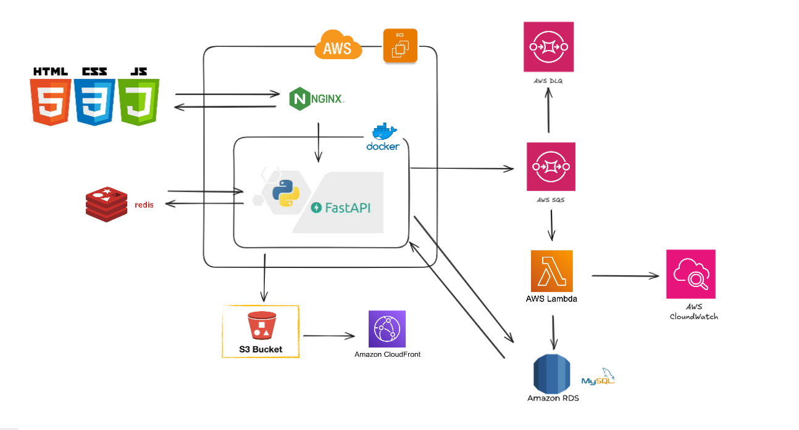
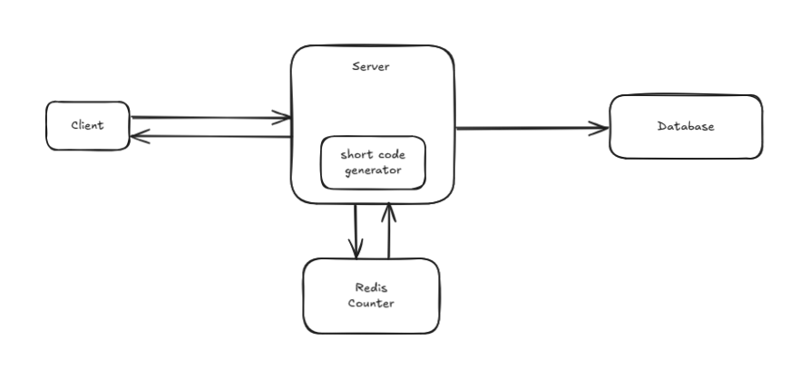
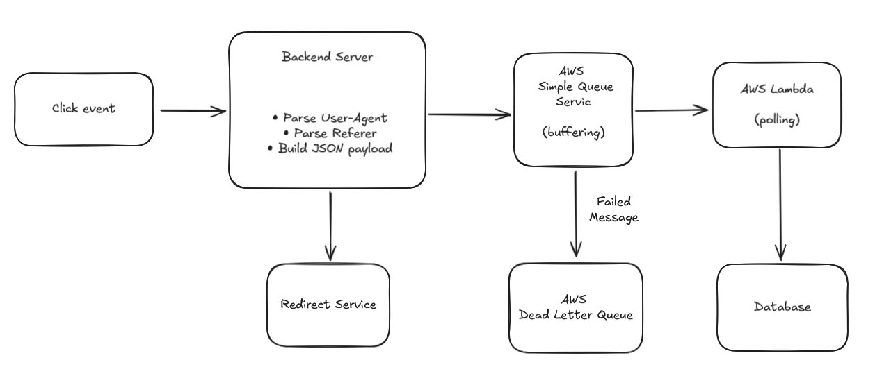

# Shortsight

Shortsight is a lightweight, developer-friendly URL shortening service that turns long, unwieldy links into neat, memorable short URLs — with built-in analytics to track click and scan counts, UTM campaign performance, device and source breakdowns, and geographic distribution.

🔗 Website URL: <https://s.ppluchuli.com/>

## Key Features

- **Instant URL Shortening:**  
  Generate a short, memorable URL from any long link with one click.

- **QR Code Generation:**  
  Produce downloadable PNG/JPG QR codes for every short link.

- **Per-Link Monthly Trends**  
  Inspect each short URL’s click and scan activity over the past 30 days with an interactive chart.

- **Traffic Source Classification**  
  Analyze where your traffic comes from using Google Analytics–style source/medium/channel categories.

- **Global Interaction Distribution**  
  Visualize total interactions (clicks + scans) over the past month with both a line chart and a proportional symbol map.

- **UTM-Driven Insights**  
  Easily see how many clicks and scans each UTM campaign generated, distinguish new visitors from returning ones, and measure overall campaign effectiveness.

## Technical Overview

### **Tech Stack**

- **Frontend**: JavaScript, HTML, CSS

- **Backend**: FastAPI (Python)
- **Database**: MySQL（Amazon RDS）
- **Cache**: Redis（Increment counter）
- **Storage**: AWS S3（QR Code images）
- **Container & Proxy**: Docker + Nginx
- **CI/CD**: GitHub Actions → Docker Hub → EC2
- **Monitoring**: AWS CloudWatch

### **System Architecture**

## Technical Highlights

- ### Shortcode Generation Flow

  Redis’s INCR command obtains a global, atomic integer ID, which is then salted and encoded using the Hashids algorithm into a fixed 6-character shortcode—guaranteeing collision-free, consistent URL lengths without database locking.

  1. **Atomic ID**  
     Call Redis’s `INCR` to get a globally unique integer.

  2. **Encode with Hashids**  
     Use the [Hashids](https://pypi.org/project/hashids/) library to turn that integer into a 6-character alphanumeric code.

  3. **Save to database**  
     Save the short code into database so we can look it up on redirects.

  

- ### **Asynchronous Event Storage**

  To avoid slowing down redirects under heavy traffic, all click events are enqueued to an AWS SQS queue. AWS Lambda functions then consume and persist these events to the database asynchronously, decoupling event recording from the user-facing redirect path.

  1. **Parse & Enqueue**  
     Backend server parses the User-Agent and Referer, builds a JSON payload, and enqueues it to AWS SQS.

  2. **Buffer in SQS**  
     AWS SQS buffers incoming events to smooth out traffic spikes and prevent blocking the redirect path.

  3. **Poll & Consume**  
     AWS Lambda polls the SQS queue, retrieves pending messages, and prepares them for storage.

  4. **Save to Database**  
     Lambda functions write the consumed events into the database asynchronously, decoupling event recording from the user-facing redirect.

  
